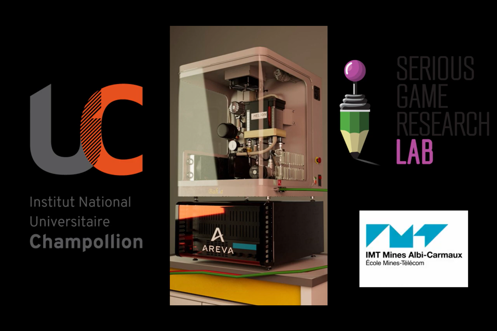

Hello! Online I am refered to as "Kiryonn". I Just "finished" my 2nd game dev master year (still have internship to complete + orals). 
My main abilities are programming and game design but I can also create some decent UIs and sounds.
Here is a list of things i worked on/with:
- [Projects](#projects)
- [Game Engines](#game-engines)
- [Languages Used](#languages-used)
- [IDEs](#ides)
- [Versionning Tools](#versionning-tools)
- [Music Tools](#music-tools)
- [Graphic Tools](#graphic-tools)

## Projects
### Fuel Cell Virtual Training

  
  

    
FCVT is a serious game made to train students on hydrogen fuel cells (PEMFC - proton exchange membrane fuel cell).

    
Here is the promotional video https://www.youtube.com/embed/5ERMEabe65o

  

 

### Tracteur en selle

  
  

    
A Serious game commissioned by the MSA (Mutuelle Santé Agricole) to present on a convention stand. It uses custom made equipments (modified exercise bike). 

    
Players can move arround by pedaling to charge the batery of the tractor and use the motorbike potentiometer implemented on the exercise bike to accelerate. They are given tasks that they must complete within the time limit in order to win the game.

    
The time limit was implemented in order to prevent people from staying too long on the stand.

  

     

## Game Engines
- [Godot](https://godotengine.org)
- [Unity](https://unity.com)
### Language packages to make a game
- Java Swing
- Pygame
- Tkinter

## Languages Used
- C
- C#
- C++
- CSS
- HTML
- GDScript
- Java
- JavaScript
- JSON
- Lua
- Markdown
- OCaml
- Python
- TOML
- XML
- YML

## IDEs
- [Arduino](https://apps.microsoft.com/detail/9NBLGGH4RSD8?hl=en-us&gl=US)
- [Godot (built-in IDE)](https://godotengine.org)
- [IDLE](https://www.python.org/downloads/)
- [IntelliJ IDEA](https://www.jetbrains.com/idea/)
- [Pycharm](https://www.jetbrains.com/pycharm/)
- [Rider](https://www.jetbrains.com/rider/)
- [Visual Studio Code](https://code.visualstudio.com)
- [Visual Studio Community](https://visualstudio.microsoft.com/vs/community/)

## Versionning Tools
- [Git](https://git-scm.com)
- [Git Kraken](https://www.gitkraken.com)
- [GitHub](https://github.com)
- [GitHub Desktop](https://desktop.github.com)

## Music Tools
- [Audacity](https://www.audacityteam.org)
- [ChordChord](https://chordchord.com)
- [LMMS](https://lmms.io)

## Graphic Tools
- [Blender](https://www.blender.org)
- [Illustrator](https://www.adobe.com/products/illustrator.html)
- [Inkscape](https://inkscape.org)
- [Krita](https://krita.org/en/)
- [Paint.net](https://www.getpaint.net/index.html)
- [Photoshop](https://www.adobe.com/products/photoshop.html)
